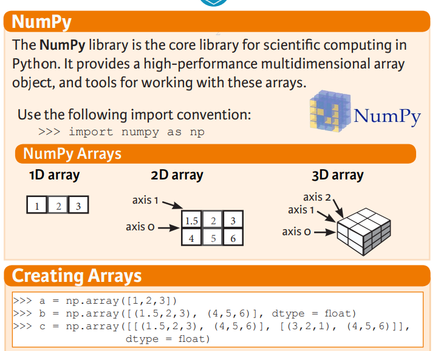
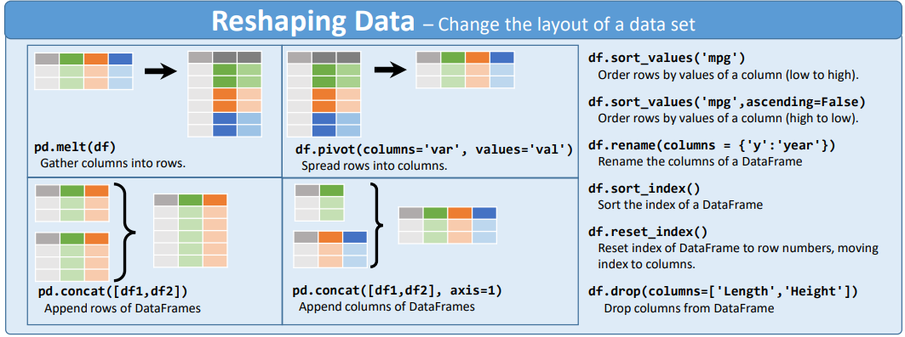

## 10 Python Libraries for Data Science
### This repository belongs to the codes and sources that I created my YouTube videos.

**NumPy Cheat Sheet:** 
**NumPy Video:** 

🔔**EN:** https://www.youtube.com/watch?v=ixUUAe8apIU&t=3s 

🔔**TR:** https://www.youtube.com/watch?v=PkI3HgqiiMo&t=208s

**Pandas Cheat Sheet:** 